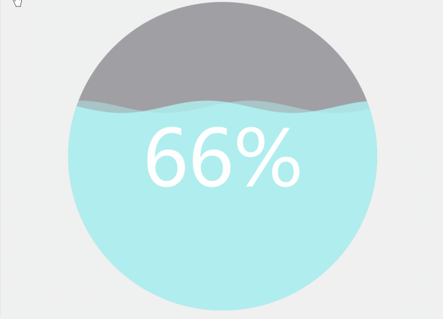
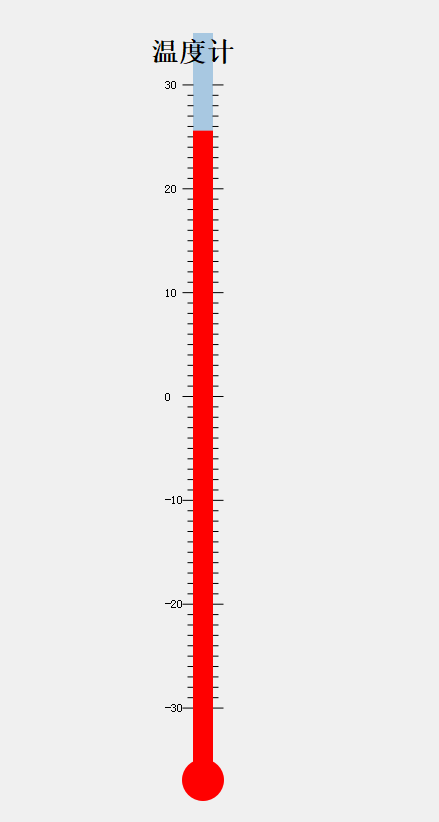
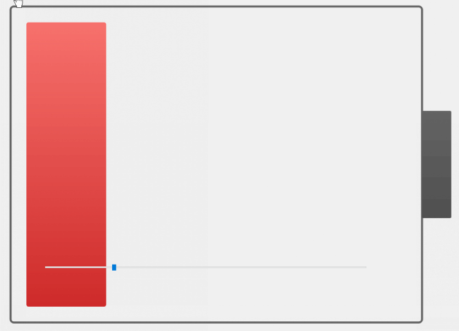
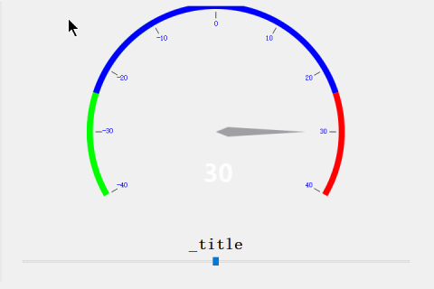
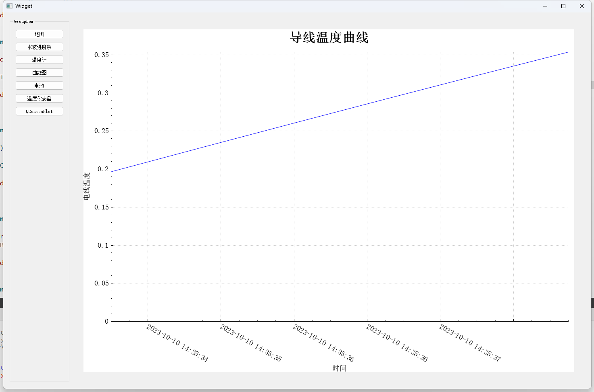

# QtSmallPorject

## 1. Qt加载百度的离线地图

### v1.0

> 一个特别简单的demo
>
> 1. qt能加载地图
> 2. qt能和js通信

## 2. 水波进度条控件

> 绘图事件中完成的

## 3. 温度计

> 绘图事件中完成的

## 4.电池

> 绘图事件中完成的

> 其他的博客文档
>
> [QtWidget绘制电池控件_qt电池控件_神威难藏泪~的博客-CSDN博客](https://blog.csdn.net/Thinking777/article/details/128766542)

## 5.增加仪表盘控件

> 绘图事件中完成的

## QCustomPlot

> 1. QCustomPlot绘制的曲线图

# QtThirdPartyOpen

## 阿木大叔

> 请参考源码：[仓库 - 阿木大叔 (hudejie) - Gitee.com](https://gitee.com/hudejie/projects)

### visualize-data-master

> 视频监控平台  [VisualizeData: 使用Qt开发的大屏监控界面，主要通过绘制和QChart开发。主要展示动态表格，精美大屏状态，过度动画，滚动动画等。该界面采用Qt的UI框架进行开发，通过精心设计的UI元素和动态效果，为用户提供了一个直观、易用、美观的界面。 (gitee.com)](https://gitee.com/hudejie/visualize-data)

